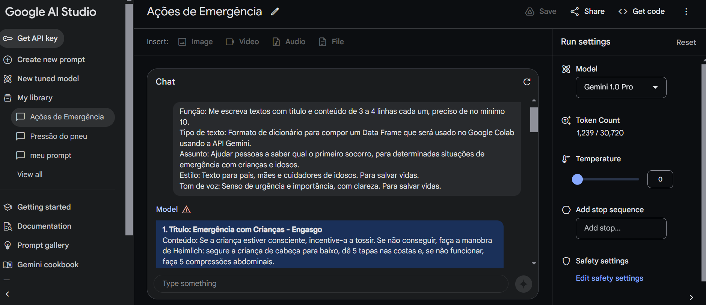

# Projeto_Sistema_de_Busca_IA_Alura_Google
Projeto de IA com Google AI Studio

Uso da IA em um aplicativo Web ou Mobile, para ajudar as pessoas saberem qual os primeiros socorros, para determinadas situações de emergência com crianças e idosos.  
Num projeto real a entrada pode ser feita por voz, que a IA do Google vai transcrever a consulta, o que pode ser muito importante numa situação de emergência onde pode não ser possível digitar. 

### Consulta do Gemini Google AI Studio:

Função: Me escreva textos com título e conteúdo de 3 a 4 linhas cada um, preciso de no mínimo 10.  
Tipo de texto: Formato de dicionário para compor um DataFrame que será usado no Google Colab usando a API Gemini.  
Assunto: Ajudar pessoas a saber qual o primeiro socorro, para determinadas situações de emergência com crianças e idosos.  
Estilo: Texto para pais, mães e cuidadores de idosos. Para salvar vidas.  
Tom de voz: Senso de urgência e importância, com clareza. Para salvar vidas.  

Linguagem utilizada:  

